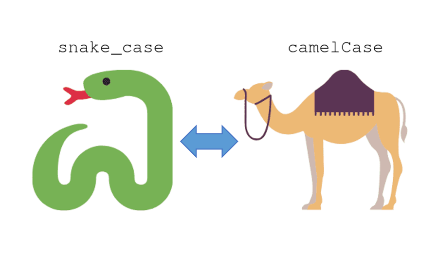

[](https://www.mathworks.com/matlabcentral/fileexchange/101118-convert-naming-convention)

# Convert Naming Convention
Convert from snake case to camel/pascal case and vice versa.



## Snake Case to Camel Case

### Syntax:
- **camelCase = snake2camel(snake_case)**
- **camelCase = snake2camel(snake_case, Name, Value)**

### Input Arguments:
- **snake_case** - Input text in snake case. [string array | character vector | cell array of character vectors]

### Name-Value Pair Arguments:
- **FirstLetter** - Used to set the first letter in lower or upper case. ['lower' (default), 'upper']

### Examples:
```matlab
% Example 1: Convert from snake case to camel case 
snake_case = ["num_files", "variable_name", "some_function"];
camelCase = snake2camel(snake_case);

% Example 2: Convert from snake case to pascal case
snake_case = ["num_files", "variable_name", "some_function"];
PascalCase = snake2camel(snake_case, 'FirstLetter', 'upper');
```


## Camel Case to Snake Case

### Syntax:
- **snake_case = camel2snake(camelCase)**

### Input Arguments:
- **camelCase** - Input text in camel case. [string array | character vector | cell array of character vectors]

### Examples:
```matlab
% Example 1: Convert from camel case to snake case
camelCase = ["nFiles", "VariableName", "someFunction"];
snake_case = camel2snake(camelCase);
```

### Author:
- Moses Yoo, (juyoung.m.yoo at gmail dot com)

## Special Thanks:
Special thanks to Stephen for showing and explaining the much simpler regular expression version!

[](https://www.mathworks.com/matlabcentral/fileexchange/101118-convert-naming-convention)