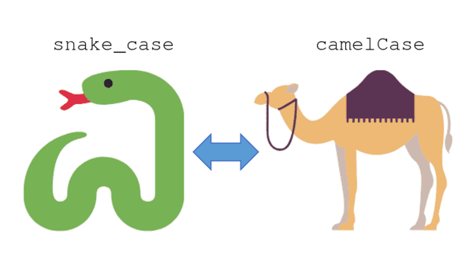

[](https://www.mathworks.com/matlabcentral/fileexchange/101118-convert-naming-convention)

# Convert Naming Convention
Convert from snake case to camel/pascal case and vice versa.

<p align="center">
  
</p>

## Snake Case to Camel/Pascal Case

### Syntax:
- **[camelCase, PascalCase] = snake2camel(snake_case)**
- **snake_case = camel2snake(camelCase)**

### Input Arguments:
- **snake_case** - Input text in snake case. [string array | character vector | cell array of character vectors]
- **camelCase**  - Input text in camel case. [string array | character vector | cell array of character vectors]

### Examples:
```matlab
% Example 1: Convert from snake case to camel/pascal case 
snake_case = ["num_files", "variable_name", "some_function"];
[camelCase, PascalCase] = snake2camel(snake_case);

% Example 2: Convert from camel case to snake case
camelCase = ["nFiles", "VariableName", "someFunction"];
snake_case = camel2snake(camelCase);
```

### Author:
- Moses Yoo, (juyoung.m.yoo at gmail dot com)

## Special Thanks
Special thanks to Stephen for showing and explaining the much simpler regular expression version!

[](https://www.mathworks.com/matlabcentral/fileexchange/101118-convert-naming-convention)